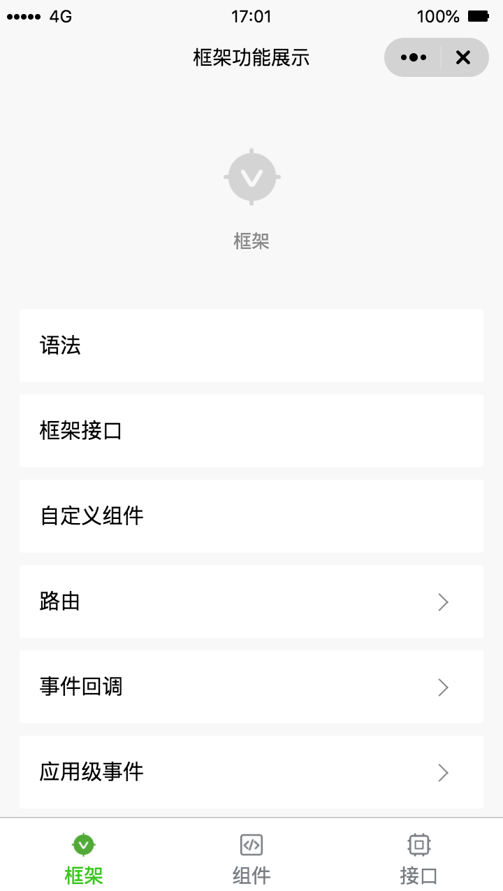
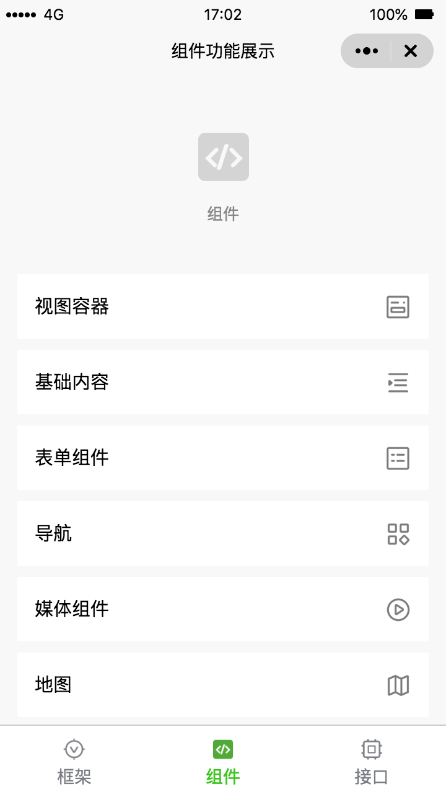
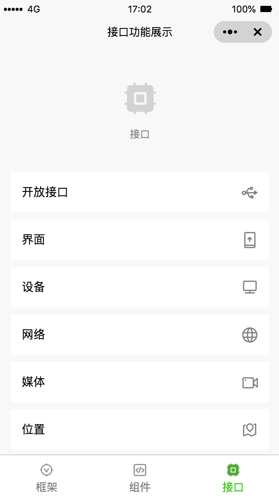

# quickapp-sample

## 小程序转快应用工具

快应用是基于手机硬件平台的新型应用形态。小程序转快应用工具提供了一种新的开发快应用方式，开发语法和其他小程序一致，能帮助开发者快速接入快应用。 quickapp-sample 演示了小程序转换快应用能力。

## 预览 quickapp-sample

1. 根据 [文档](https://qapp-chimera.vivo.com.cn/framework/quickstart/getstart.html) 安装 `快应用开发工具（IDE）` 及 `hap-chimera-toolkit 插件`
2. 下载 quickapp-sample 项目，在 `快应用开发工具（IDE）` 中 文件 - 打开 选择 quickapp-sample

## 预览截图

## 更多资料

- 小程序转快应用文档：https://qapp-chimera.vivo.com.cn
